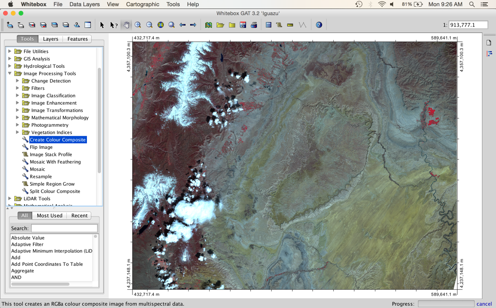

Whitebox Geospatial Analysis Tools
=====================================

Description
-----------
Whitebox GAT is an open-source geographical information system (GIS) and remote sensing package (http://www.uoguelph.ca/~hydrogeo/Whitebox/). The Whitebox GAT project began in 2009 and was conceived as a replacement for the Terrain Analysis System (TAS). Whitebox GAT was intended to have a broader focus than its predecessor, positioning it as an open-source desktop GIS and remote sensing software package for general applications of geospatial analysis and data visualization. Whitebox GAT is intended to provide a platform for advanced geospatial data analysis with applications in both environmental research and the geomatics industry more broadly. It was envisioned from the outset as providing an ideal platform for experimenting with novel geospatial analysis methods. Equally important is the project’s goal of providing a tool that can be used for geomatics-based education.

Getting Started
---------------
Compiled versions of Whitebox GAT are available from the Whitebox homepage (http://www.uoguelph.ca/~hydrogeo/Whitebox/). To work with the source code, clone the Github repository using *git* and open the individual projects in *NetBeans IDE* (https://netbeans.org/). NetBeans may complain that there are unresolved conflicts, likely that there are missing library files. Click to resolve the conflicts. You will find each of the library dependencies within the *WhiteboxGIS* project folder.

Screenshots
-----------

License
-------
Whitebox GAT is distributed under the  version 3).
